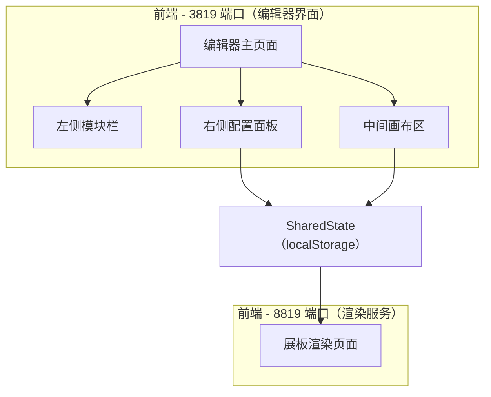

## 1. 架构设计



双端口架构：
- **3819 端口**：Vite 开发服务器，运行编辑器界面（React SPA），用户在此拖拽模块、调整参数
- **8819 端口**：Vite 开发服务器，运行纯渲染页面，读取共享状态实时展示展板效果
- 两个端口通过 **localStorage** 同步状态（同源策略下共享），编辑器修改参数后渲染页面通过 `storage` 事件监听实时刷新

## 2. 技术说明

- 前端：React@18 + TypeScript + Tailwind CSS@3 + Vite
- 初始化工具：vite-init（react-ts 模板）
- 状态管理：Zustand（编辑器状态）+ localStorage 跨端口同步
- 拖拽：原生 HTML5 Drag & Drop API
- 后端：无
- 数据库：无，全部为前端内存/mock 数据

## 3. 路由定义

| 路由 | 用途 | 端口 |
|------|------|------|
| / | 编辑器主页面（模块栏 + 画布 + 配置面板） | 3819 |
| / | 展板渲染页面（纯展示，只读渲染画布） | 8819 |

## 4. API 定义

无后端 API。双端口通过 localStorage 事件通信。

### 共享状态数据结构

```typescript
interface BoardModule {
  id: string
  type: 'text' | 'specimen' | 'schedule'
  x: number
  y: number
  width: number
  height: number
  content: TextContent | SpecimenContent | ScheduleContent
}

interface TextContent {
  title: string
  body: string
}

interface SpecimenContent {
  image: string
  name: string
  latinName: string
  description: string
}

interface ScheduleContent {
  rows: { time: string; activity: string; location: string }[]
}

interface BoardTheme {
  id: 'spring' | 'autumn'
  primaryColor: string
  secondaryColor: string
  accentColor: string
  bgColor: string
  textColor: string
  decorationPattern: 'petals' | 'leaves'
}

interface BoardState {
  modules: BoardModule[]
  theme: BoardTheme
  fontSize: number
}
```

## 5. 服务端架构图

不适用

## 6. 数据模型

不适用（纯前端项目，无数据库）

### Mock 数据

项目内置两组主题配置和示例模块数据，供开发调试使用。
